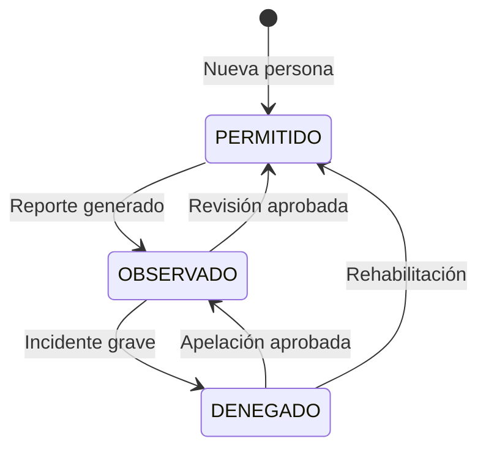

# Estado del proyecto y registro de mejoras — VC-INGRESO

Este documento consolida el **estado frente al plan de trabajo**, los **pendientes por prioridad** y el **historial de mejoras**. El **contrato de la API** está en [server/API.md](server/API.md); el resto del contexto técnico (BD, despliegue, flujos) en [plans/REFERENCIA_TECNICA.md](plans/REFERENCIA_TECNICA.md).

---

## 1. Resumen ejecutivo

**VC-INGRESO** es un sistema de control de acceso residencial con:

- **Entornos**: desarrollo (`docker-compose.dev.yml`), stage (`docker-compose.stage.yml`), producción (`docker-compose.prod.yml` o `docker-compose.prod-rds.yml`). Backup y despliegue: [plans/REFERENCIA_TECNICA.md](plans/REFERENCIA_TECNICA.md) (sección 10).
- **Frontend**: Angular 18 + Angular Material + Tailwind CSS.
- **Backend**: PHP 8.2 + MySQL, API REST en `server/index.php`, controladores en `server/controllers/`.
- **Autenticación**: JWT.

El modelo de datos evolucionó hacia un enfoque **house-centric** (`house_members`, permisos, `GET /api/v1/houses/:id/members`). Parte de la documentación histórica distingue entre “vacío lógico” user ↔ person y el diseño actual con `person_id` en users; ver referencia técnica.

**Avance reciente (jun 2026):** flujo de garita operativo (escáner QR, visitas externas con timer, incidencias), auditoría de eventos, permisos de módulos por rol, dashboard con aforo básico y refactor UI (tablas expandibles, dark mode).

---

## 2. Hito alcanzado: base de datos y backend coherentes

### Base de datos

- **Script principal de esquema**: `database/vc_create_database.sql` crea la BD **vc_db**, tablas (entre otras: houses, users, access_points, persons, vehicles, temporary_visits, temporary_visit_assignments, access_logs, temporary_access_logs, access_incidents, event_logs, nav_modules, pets, reservations, house_members, announcements, surveys según versión del script) y claves foráneas. Init Docker: usuario root y esquema vía `database/init-docker.sh` donde aplique.
- **Migraciones incrementales**: `database/migrations/001_nav_permissions.sql` … `006_temporary_access_logs_improvements.sql` para BDs existentes.
- **Datos de prueba**: `database/vc_dev_data.sql`.
- **Licencias Crearttech**: `database/crearttech_clientes_schema.sql` (BD `crearttech_clientes`).

### Backend (API v1)

- Controladores típicos: Auth, User, Person, House, Vehicle, ExternalVehicle, Pet, AccessLog, AccessQr, AccessIncident, Reservation, PublicRegistration, Catalog, Announcement, Survey, NavPermissions, EventLog, ReadonlyDocuments.
- Rutas en `server/index.php`; JWT con `requireAuth()`; registro público sin auth en rutas `public/*`.
- Documentación de endpoints: [server/API.md](server/API.md) (fuente principal); contexto en [plans/REFERENCIA_TECNICA.md](plans/REFERENCIA_TECNICA.md).

### Migración backend (completada según plan)

- Conexión única: `server/db_connection.php` (`getDbConnection()`); `Controller.php` unificado.
- Auth: `POST /api/v1/auth/login` (sustituye flujos legacy tipo `getUser.php`).
- Catálogos: `CatalogController` — áreas, salas, prioridad desde `access_points`; stubs (arrays vacíos o null) para collaborator, personal, payment-by-client, activities-by-user, machines, inc-pendientes, etc., hasta existan datos en vc_db.
- Reportes en `AccessLogController`: entrance-by-range, history-by-date, history-by-range, history-by-client; aforo, address, total-month, total-month-new, hours, age.
- Users/Persons: endpoints como by-doc-number, by-birthday (con JOIN a houses para block/lot donde corresponda), listados destacados según implementación.
- Frontend migrado a servicios que consumen `api/v1/...` (AuthService, UsersService, AccessLogService, EntranceService, etc.).
- **Legacy eliminado** en gran medida: estructura `index.php` + router, `db_connection.php`, controladores, utils, middleware JWT; eliminación masiva de `.php` sueltos por nombre.

---

## 3. Estado actual — Frontend (según plan de trabajo)

### Servicios y componentes integrados

- **Servicios**: ApiService, AuthService, UsersService, PetsService, ReservationsService, AccessLogService, EntranceService, QrAccessService, AccessIncidentService, EventLogService, NavPermissionService. UsersService y AccessLogService alineados con API v1.
- **Componentes**: History (AccessLogService), Birthday (cumpleaños vía API), Pets, Reservaciones (vista mes + tabla), página Código QR (escáner + Mi QR), **Incidencias** (`/incidents`), **Auditoría de eventos** (pestaña en Configuración), Webcam; rutas como `/pets`, `/reservations`, `/codigo-qr` (`/scanner` redirige), `/incidents`; menú filtrado por permisos de módulo.
- **Formulario de registro público**: secciones UI en [plans/REFERENCIA_TECNICA.md](plans/REFERENCIA_TECNICA.md) (§13); flujo de fotos (§11). Endpoints: [server/API.md](server/API.md) (registro público y uploads).
- **Permisos de navegación**: matriz configurable por rol (ADMINISTRADOR / OPERARIO / USUARIO) en Configuración → Permisos; `ModuleGuard` en rutas de gestión; catálogo en `nav-modules.config.ts`.

### Correcciones UI realizadas (plan)

- **Login**: logo con fallback a `assets/logo_VC5.png`; modal de cambio de contraseña con botón visible (`!bg-amber-600 !text-white`).
- **Side-nav / Nav-bar**: avatar por género cuando no hay `photo_url`; nombre, `role_system` y domicilio con fallbacks; logo header.
- **Inicio (dashboard)**: imágenes de puntos de acceso con fallback; datos reales (accesos rápidos, ingresos del día, cumpleaños, reservas próximas) según servicios.

### Refactor frontend — referencia histórica

- Servicios eliminados del scope antiguo: `clientes.service`, `ludopatia.service`, `personal.service`, `systemClient.ts`, `person.ts` (legacy), etc.
- **ListrasComponent**: marcado fuera de scope; sustitución futura por UI de personas unificada.
- Detalle de métodos UsersService / AccessLogService: [plans/REFERENCIA_TECNICA.md](plans/REFERENCIA_TECNICA.md) (§12).

---

## 4. Roadmap por fases (actualizado junio 2026)

### Fase 1 — Cerrar flujos clave *(parcialmente avanzada)*

1. **Registro público (UI completa)**: secciones vivienda → propietario(s) → vehículos → mascotas; RENIEC en frontend; `POST /api/v1/public/register`; ruta pública sin login (ej. `/registro`). *Pendiente.*
2. **Reservaciones** (áreas comunes): UI vista mes + solicitudes; consumo de `api/v1/reservations`. *Base operativa; falta pulir flujo Casa Club y notificaciones.*
3. **Mi Casa**: residentes, inquilinos, visitas, vehículos, mascotas, **visitas externas con asignación temporal y timer**. *Avanzado; ver §10.13.*
4. **Escáner / Código QR en garita**: validación unificada (JWT, DNI, placa), registro INGRESO/EGRESO, selección multi-casa, incidencias desde escaneo. *Operativo en V1; ver §10.13.*
5. **Dashboard Piscina / Aforo**: widget de ocupación en dashboard (staff y vecino). *Básico implementado; falta vista dedicada tiempo real / alertas de aforo.*

### Fase 2 — Pulir, datos y operación

6. **Subida de fotos**: módulo coherente (vehículos, mascotas, perfil, incidencias, visitas externas); endpoints y `photo_url` en BD. *Parcial.*
7. **Incidencias de acceso**: listado, alta manual y desde escáner, foto adjunta, vínculo con logs. *Implementado; ver §10.13.*
8. **Auditoría de eventos**: registro automático en acciones CRUD sensibles; consulta admin (30 días, paginado). *Implementado; ver §10.14.*
9. **Sustituir stubs del Catalog** cuando existan tablas/datos reales.
10. **Licencias / pagos (Crearttech)**: API y UI sobre `crearttech_clientes` (clients, payment). *Pendiente.*

### Fase 3 — Producción, seguridad y calidad

11. **Seguridad**: CSRF en acciones sensibles; rate limiting en login y registro público; HTTPS en despliegue. *IP real en logs ya resuelta (Apache `RemoteIP`); ver §10.15.*
12. **Calidad**: OpenAPI/Swagger; tests backend; loading states y retry en frontend; interfaces tipadas (limpieza de modelos legacy en frontend).
13. **Limpieza**: eliminar `bd.php`, `bdEntrance.php`, `bdData.php` y referencias a BDs legacy cuando el frontend no las use.
14. **Escáner V2**: soporte HID dedicado, pantalla garita fullscreen, WebSocket/polling para aforo en vivo.

---

## 5. Pendientes por prioridad (checklist del plan)

### Prioridad alta

- [ ] Controlador de **pagos / licencias** (API y UI Crearttech).
- [ ] Completar **UI de Reservaciones** (Casa Club / áreas): aprobaciones, estados y notificaciones al vecino.
- [ ] **Registro público** completo (UI multi-sección + RENIEC + ruta `/registro` sin login).
- [ ] **Vista dedicada Aforo-Piscina** con actualización periódica (polling o WebSocket); el dashboard ya muestra ocupación básica.

### Prioridad media

- [x] **Escáner / Código QR en garita** — validación, INGRESO/EGRESO, visitas externas multi-casa, cooldown visual, incidencias post-escaneo *(jun 2026)*.
- [x] **Incidencias de acceso** — CRUD admin, modal desde escáner, foto, contexto de log *(jun 2026)*.
- [x] **Permisos configurables** de pestañas de gestión por rol *(jun 2026)*.
- [x] **Auditoría de eventos** — backend + pestaña admin en Configuración *(jun 2026)*.
- [ ] **Módulo de gestión de imágenes** unificado (upload, filesystem; S3 opcional después). *Subidas dispersas ya funcionan en mascotas, vehículos, incidencias y visitas externas.*
- [ ] Mejoras de UI restantes: registro público, Reservaciones (flujo completo), pantalla garita fullscreen.
- [ ] Campo **qr_code** persistente en `persons` (hoy QR vía JWT en `access-qr/generate`).
- [ ] Formulario genérico para registros futuros.
- [ ] OpenAPI/Swagger; tests unitarios backend; interfaces tipadas; loading/retry global.
- [ ] **Eliminar legacy** de conexiones y BDs antiguas cuando no haya dependencias. *Frontend: eliminados `clientes.service`, `collaborator.ts`, `payment.ts`, `area.ts`, diálogos legacy del dashboard.*

### Seguridad y despliegue

- [x] **IP de cliente confiable** en logs de auditoría (`client_ip.php`, Apache `RemoteIP`, Docker) *(jun 2026)*.
- [ ] Tokens CSRF.
- [ ] Rate limiting API (login, registro público, escaneo).
- [ ] HTTPS en despliegue.

---

## 6. Estructura objetivo “Mi Casa” (referencia)

```
mi-house/
├── residentes          # Persona tipo RESIDENTE
├── visitas             # Persona tipo VISITA (+ QR de ingreso)
├── inquilinos          # Persona tipo INQUILINO
├── vehículos           # Vehículos asociados (+ QR)
├── visitas externas    # temporary_visits + asignaciones por casa (timer, vigencia)
├── mascotas            # Mascotas (por house_id)
├── piscina             # Access point + aforo (widget en dashboard)
├── garita              # Access point + escáner QR
├── formulario          # Registro genérico (pendiente)
└── casa-club           # Reservaciones (vista mes / API reservations)
```

---

## 7. Visión MVP — Escáner unificado (estado jun 2026)

Versión 1 como **módulo central** que captura lecturas, valida, resuelve identidad y registra el evento.

| Capacidad | Estado |
|-----------|--------|
| **Cámara QR** (`qr-scanner.component`) | Implementado: punto de acceso, INGRESO/EGRESO, cooldown visual, visitas externas multi-casa |
| **Manual DNI/placa** vía mismo endpoint `access-qr/scan` | Implementado en backend |
| **QR del sistema** (JWT persona/vehículo) | `generate` + `validate` + escaneo |
| **Visitas externas** con asignación y timer | Catálogo global + `temporary_visit_assignments`; entrada/salida en `temporary_access_logs` |
| **Incidencias desde escaneo** | Modal post-validación con contexto del log |
| **HID** (lector USB código de barras) | Pendiente — hoy la cámara captura texto; falta foco dedicado garita |
| **OCR/LPR** | Pospuesto |

- **Generación de credenciales**: desde Mi Casa (QR persona/visita/vehículo) y API `access-qr/generate`.
- **Historial unificado**: `history-by-date` mezcla `access_logs` + `temporary_access_logs`.

---

## 8. Diagrama de estados de personas

Estados: `PERMITIDO` (default), `OBSERVADO`, `DENEGADO`.



---

## 9. Notas de negocio y documentación (del plan)

- Mantener compatibilidad con endpoints legacy hasta migración total del frontend.
- **Propietario**: históricamente en tabla Users; conviene revisar flujo Persons vs Users frente a `house_members`.
- **Registro**: si una casa ya tiene propietario, no debería ofrecerse en desplegables de nuevo registro (reducir opciones según datos existentes).
- Refactor de servicios y componentes: resumido en [plans/REFERENCIA_TECNICA.md](plans/REFERENCIA_TECNICA.md) (§12).
- **Futuro**: panel de suscripción Crearttech y VC5.

---

## 10. Registro de mejoras implementadas (marzo 2026 — contenido temático)

### Fechas de registro

- **2026-03-16**: mejoras base (tablas, fotos, backend house members, domicilio en listados).
- **2026-03-18**: carga de fotos en mascotas/vehículos y estandarización de modales.
- **2026-05-07**: comunicados y encuestas (CRUD admin + UX de notificaciones y priorización en navbar).
- **2026-06-27 / 2026-06-28**: permisos de navegación, auditoría de eventos, escáner garita, visitas externas con timer, incidencias, refactor UI (tablas expandibles, dark mode), dashboard simplificado, IP confiable en logs.

### 10.1 Mi Casa — Tablas (Residentes, Inquilinos, Mascotas, Vehículos)

- Columna **Foto** en las cuatro tablas.
- Renderizado: si existe `photo_url`, ``; si no, placeholder circular con `mat-icon` (person / pets / directions_car).
- Acciones: `visibility` (vista), `edit` (edición).

### 10.2 Modal de vista de foto en `my-house`

- Estilos: `.photo-view-overlay`, `.photo-view-modal`, `.photo-view-header`, `.photo-view-img`.
- Métodos: `openViewPhoto(item, title)`, `closeViewPhoto()`.

### 10.3 Corrección TS2341 (`api` pública)

- En `my-house.component.ts`: `private api: ApiService` → `public api: ApiService` para uso desde plantilla si aplica.

### 10.4 Backend `HouseController::members`

- SELECT incluye `p.photo_url` en joins de `house_members` y fallback por `house_id` en persons, para mostrar foto desde `persons.photo_url`.

### 10.5 `canAccessHouse` y fallback `house_id`

- Lógica de acceso: token `house_id`, tabla `house_members`, fallback `persons.house_id`.

### 10.6 Vehicles — Domicilio (Mz/Lt/Dpto)

- `getHouseLocation(v)` en `vehicles.component.ts`: busca `house` en `houses`, fallback `block_house` / `lot` / `apartment`, formato `MZ:… LT:… DPTO:…`, mayúsculas.
- Plantilla: `{{ getHouseLocation(v) }}`.

### 10.7 Users — Domicilio y mayúsculas

- `getHouseLocation(u)` análogo a vehículos.
- Nombre en mayúsculas con `toUpperCase()` donde se aplicó.

### 10.8 Actualización 2026-03-18 — Mascotas y vehículos (cámara)

- Botón de cámara en acciones de tablas de mascotas y vehículos.
- Inputs `file` por fila; eventos `(change)` a métodos dedicados.
- `PublicRegistrationService` reutilizado para subida.
- Métodos: `onVehiclePhotoSelect`, `onPetPhotoSelect`.
- Estado: `uploadingVehicleIndex`, `uploadingPetIndex`.

### 10.9 Estandarización de modales (2026-03-18)

- Modales revisados: Residentes, Inquilinos, Mascotas, Vehículos, Visitas, Vehículos externos.
- Inputs: `Celular` como `type="text"` donde correspondía; fecha de nacimiento en visitas como `type="date"`.
- Título “Editar usuario” en modal de edición de usuario.
- Visitas: categoría vía `categories_visits`.
- Campos añadidos: vehículos — Marca, Modelo, Color; mascotas — Edad, Especie (select), Color (select), Estado; residentes/inquilinos homogeneizados (Usuario, Rol, Estado de Rol, Domicilio).
- Listas: `vehicleColors`, `petColors` en `my-house.component.ts`.

### 10.10 Modelo `Vehicle`

- `vehicle.ts`: propiedades opcionales `brand`, `model`, `color`.
- Inicialización de `vehicleToAdd` / `vehicleToEdit` actualizada.

### 10.11 Validación

- Verificación en `my-house.component.ts` / `.html` sin errores de compilación reportados tras cambios.
- Recomendación: `ng serve` o `npm test` para validación UI.

### 10.12 Comunicados y encuestas (actualización 2026-05-07)

- **Comunicados (admin)**:
  - Componente en `src/app/announcements/announcements.component.*` (fuera de `readonly`).
  - CRUD con estado **Activo/Inactivo** (sin borrado físico).
  - Soporte de imagen: carga de archivo + `image_url` + vista previa en formulario y en popup.
- **Encuestas (admin)**:
  - Componente en `src/app/surveys/surveys.component.*`.
  - CRUD con estado **Activa/Inactiva** (sin borrado físico).
  - Tipos soportados: `CLOSED`, `OPEN`, `MULTIPLE`, `CHECKBOX`.
  - Registro de resultados por alternativa (`option_counts`) en listado admin.
- **Flujo UX en navbar**:
  - Prioridad de visualización: **cola completa de comunicados activos** y luego **encuestas pendientes**.
  - Reapertura desde campana de notificaciones.
  - Indicador visual (punto **amarillo**) cuando existen comunicados no vistos o encuestas pendientes.
- **Backend/API y datos**:
  - Rutas nuevas en `server/index.php` para `announcements` y `surveys` (incluye `active`, `respond`, `results`, upload de imagen).
  - `AnnouncementController` y `SurveyController` con inactivación por estado (`is_active = 0`) para preservar histórico.
  - `server/storage/readonly_data.json` ya no contiene bloque `announcements` (migrado a BD).
  - Script de esquema actualizado en `database/vc_create_database.sql` para tablas `announcements`, `surveys`, `survey_responses`.

### 10.13 Actualización 2026-06-27/28 — Garita, visitas externas e incidencias

- **Visitas externas (modelo house-centric)**:
  - Migraciones `004_temporary_visit_assignments.sql`, `006_temporary_access_logs_improvements.sql`.
  - Catálogo global `temporary_visits` ampliado (`photo_url`, notas, auditoría de usuario).
  - Tabla `temporary_visit_assignments`: asignación visita → casa con `valid_from` / `valid_until` y estados ACTIVA|EXPIRADA|CANCELADA.
  - `ExternalVehicleController` y helper `temporary_visit.php`: CRUD, asignaciones, expiración.
  - Mi Casa: pestaña **Visitas externas**; escaneo con selección multi-casa (`scan` + `scan-confirm`).
- **Registro de acceso temporal**:
  - `POST /api/v1/access-logs/temporary` (entrada) y `/temporary/exit` (salida) con control de sesión abierta, permanencia y `stay_exceeded`.
  - Historial unificado en `AccessLogController` (`access_logs` + `temporary_access_logs`).
- **Escáner QR (`qr-scanner.component`)**:
  - Punto de acceso y modo INGRESO/EGRESO persistidos en `localStorage`.
  - Validación vía `access-qr/scan`; cooldown con imagen de estado; registro automático según modo.
  - Flujo visitas externas: pending house selection → confirmación → log temporal.
  - Botón de incidencia post-escaneo (permiso `incidents.manage`).
- **Incidencias de acceso**:
  - Migración `005_access_incidents.sql`; `AccessIncidentController` (listado, detalle, alta multipart).
  - UI `/incidents` + `IncidentFormDialogComponent` (desde escáner o manual).
  - Fuentes `scan` | `manual`; vínculo opcional a `access_log_id` o `temp_access_log_id`.
- **Dashboard**:
  - Eliminados diálogos legacy (`dialog-revalidar`, `dialog-select-sala`); componente reducido (~1400 líneas menos).
  - Gráficos corregidos: barras por hora y donut de distribución de visitantes.
  - Widget de **aforo piscina** (`poolOccupancy`) desde access-points con `controla_aforo`.

### 10.14 Actualización 2026-06-28 — Auditoría de eventos

- **Base de datos**: migración `003_event_logs.sql`; tabla `event_logs`; evento MySQL de purga a 30 días.
- **Backend**: helper `event_log.php`; `EventLogController` (listado paginado, catálogo de acciones).
- **Instrumentación**: hooks en Auth, User, Person, House, Vehicle, Pet, Reservation, Announcement, Survey, AccessLog, NavPermissions, ReadonlyDocuments y manejador de errores.
- **Frontend**: `EventLogsComponent` embebido en Configuración → pestaña **Auditoría** (solo ADMINISTRADOR).
- **API**: documentado en [server/API.md](server/API.md) (`GET /api/v1/admin/event-logs`, `/actions`).

### 10.15 Actualización 2026-06-28 — Permisos de navegación e IP confiable

- **Permisos configurables**:
  - Migración `001_nav_permissions.sql`; tablas `nav_modules`, `nav_role_permissions`.
  - `NavPermissionsController`, helper `nav_permissions.php`, `ModuleGuard` en rutas de gestión.
  - UI matriz en Configuración → **Permisos de módulos** (view/manage por rol).
  - Sidebar filtra entradas según permisos resueltos; corrección de etiquetas UTF-8 (`002_fix_nav_module_labels.sql`).
- **Correcciones operativas**:
  - Alta de **operario** sin domicilio ni categoría obligatorios (`UserController`).
  - Restauración de datos de sesión en sidebar (`side-nav`); fix genérico en `NavPermissionService.getRaw`.
- **IP de cliente**:
  - Helper `client_ip.php`; Apache `RemoteIP` en Docker; IP registrada en `event_logs` y errores.

### 10.16 Actualización 2026-06-27/28 — Refactor UI y dark mode

- **Estilos compartidos**: clases `.vc-field`, `.vc-btn-*`, `.vc-tbody-row`, `.vc-td`; utilidad `expandable-row.ts` en tablas (Users, Vehicles, Pets, History, My House, etc.).
- **Dark mode**: contraste en formularios (Comunicados, Encuestas), botones outline y campos globales en `styles.css`.
- **Dependencias Angular**: actualización menor en `package.json`; limpieza de modelos/servicios legacy no usados (`clientes.service`, `collaborator.ts`, `payment.ts`, `area.ts`).
- **Componentes pulidos**: Birthday, Houses, Settings, Access Points con layout responsive coherente.

---

## 11. Documentación del repositorio

| Archivo | Contenido |
|---------|-----------|
| [README.md](README.md) | Entrada al proyecto e instalación rápida |
| [server/API.md](server/API.md) | Contrato REST v1 (rutas y cuerpos; alineado a `index.php`) |
| Este archivo | Estado, roadmap, pendientes, mejoras implementadas |
| [plans/REFERENCIA_TECNICA.md](plans/REFERENCIA_TECNICA.md) | Bases de datos, flujos, deploy, modelos, contexto ampliado |

## 12. Próximas etapas sugeridas (post jun 2026)

Orden recomendado según dependencias y valor operativo:

| Etapa | Objetivo | Entregables clave |
|-------|----------|-------------------|
| **A** | Cerrar onboarding vecino | UI `/registro` multi-paso, RENIEC, validación “casa sin propietario duplicado” |
| **B** | Garita producción | Modo pantalla completa, foco HID/USB, rate limit en `access-qr/scan`, pruebas en hardware real |
| **C** | Aforo en vivo | Vista `/aforo-piscina` o panel garita con polling 5–10 s; alertas al 80/100 % |
| **D** | Reservaciones Casa Club | Flujo solicitud → aprobación admin → notificación; calendario compartido por área |
| **E** | Crearttech | `PaymentController` + panel suscripción / estado de licencia |
| **F** | Calidad y despliegue | OpenAPI desde `API.md`, tests PHPUnit en controllers críticos, CSRF + HTTPS en prod |

**Quick wins** (1–2 días cada uno): retry/loading en escáner e historial; tipar interfaces Angular restantes (`externalVehicle.ts` ya iniciado); documentar migraciones en README de `database/migrations/`.

---

*Para nuevos entornos prevalece `database/vc_create_database.sql` (+ `vc_dev_data.sql` en desarrollo). En BDs ya desplegadas, aplicar migraciones en orden numérico. Detalle en la referencia técnica §4.*
