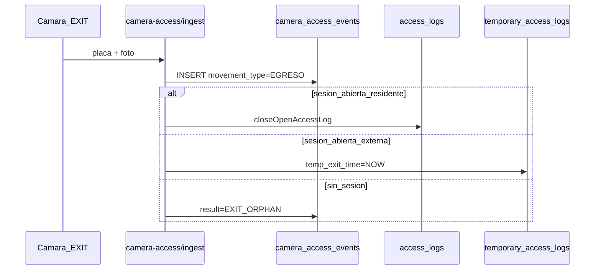

# Especificación LPR — EGRESO automático (fase posterior)

Documento de diseño para cerrar el ciclo entrada/salida con cámaras LPR. **No implementado** en la iteración actual (solo INGRESO automático).

## Estado actual (v1)

- `POST /api/v1/camera-access/ingest` crea únicamente **INGRESO** cuando la placa está autorizada.
- Eventos crudos en `camera_access_events` (ALLOWED / DENIED / IGNORED_DUPLICATE).
- No hay cierre automático de sesión al detectar placa saliendo.
- Incidencias (`access_incidents`) no se crean desde LPR.

## Objetivo v2

Detectar placa en **punto de salida** configurado y cerrar la sesión abierta correspondiente (residente o visita externa), registrando trazabilidad en `camera_access_events`.

## Requisitos funcionales

1. **Configuración por cámara**
   - Campo `movement_role`: `ENTRY` | `EXIT` | `BOTH` (default `ENTRY`).
   - Opcional: vincular cámara a `access_point_id` de salida distinto del de entrada.

2. **Reglas de ingest en EXIT**
   - Normalizar placa y aplicar debounce (reutilizar ventana actual).
   - Buscar último INGRESO abierto (misma lógica que `AccessLogController::closeOpenAccessLog`):
     - Primero en `access_logs` (persona/vehículo/placa).
     - Si no hay match, buscar `temporary_access_logs` con `temp_exit_time IS NULL`.
   - Si hay sesión: cerrar (UPDATE o POST interno EGRESO / `temporary/exit`).
   - Si no hay sesión: registrar evento `EXIT_ORPHAN` en `camera_access_events` (auditoría, sin fila EGRESO huérfana automática salvo flag configurable).

3. **Enriquecimiento de `camera_access_events`**
   - Columnas propuestas: `movement_type` (`INGRESO`|`EGRESO`), `access_log_id`, `temp_access_log_id`, `session_closed` (bool).

4. **Incidencias sugeridas (opcional)**
   - Eventos DENIED/OBSERVED en EXIT: notificación UI en módulo Cámaras con enlace «Crear incidencia» prellenando snapshot (requiere log reciente o evento huérfano).

## Flujo propuesto

## Validaciones

- Misma placa no puede cerrar dos veces en ventana debounce.
- EXIT no debe crear INGRESO si la cámara está en rol EXIT exclusivo.
- Respetar punto de acceso activo e identidad snapshot al cerrar.

## Impacto UI

- **Cámaras**: badge rol Entrada/Salida; filtro eventos por `movement_type`.
- **Dashboard**: métrica «Salidas LPR hoy» (derivada de eventos o logs con `entry_source=camera` + EGRESO/cierre).
- **Historial**: sin cambio de modelo unificado; salidas externas siguen usando `date_exit`.

## Migraciones previstas

- `018_camera_movement_role.sql`: columna en `access_cameras`.
- `019_camera_events_movement.sql`: columnas en `camera_access_events`.

## Criterios de aceptación

- [ ] Placa con ingreso abierto en punto A, detectada en cámara EXIT del mismo punto → sesión cerrada con `permanence_minutes`.
- [ ] Visita externa abierta → `temp_exit_time` y `stay_exceeded` calculados.
- [ ] Placa sin sesión → evento auditado, sin inflar sesiones abiertas.
- [ ] Debounce evita doble cierre por lecturas consecutivas.
- [ ] Documentación API actualizada en `server/API.md`.

## Fuera de alcance v2

- Incidencia automática sin intervención del operario.
- Reconocimiento facial / multi-placa en un frame.
- Sincronización bidireccional con hardware de barrera.
