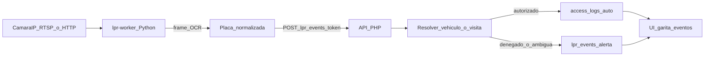

# Plan: LPR en garita (cámara fija IP)

## Decisiones de producto

| # | Decisión | Elección |
|---|----------|----------|
| 1 | Origen de imagen | Cámara IP (RTSP y/o snapshot HTTP) leída por un servicio en servidor |
| 2 | Acción al leer placa | Auto-registrar ingreso si está autorizada; alertar si no |
| 3 | Push / PR | No (por instrucción explícita) |

## Stack tecnológica elegida

### Captura y OCR (nuevo servicio)

- **Lenguaje:** Python 3.11
- **Contenedor Docker:** servicio `lpr-worker` en `docker-compose.*.yml`
- **Captura de frames:**
  - **OpenCV** (`opencv-python-headless`) para RTSP
  - **HTTP snapshot** (URL de foto de la cámara) como alternativa más estable en muchas IP cams
- **OCR / detección de placa:**
  - Motor principal: **RapidOCR** (`rapidocr-onnxruntime`) — ONNX, sin GPU, tamaño razonable en Docker
  - Filtro post-OCR de placas peruanas (normalización A–Z/0–9, misma regla que `normalize_license_plate`)
  - Confianza mínima configurable por cámara
- **Orquestación del worker:** bucle periódico (p. ej. 1–2 fps efectivos), debounce por placa+cámara, reintentos de stream

### Backend (existente + extensión)

- **PHP 8.2** (API actual en `server/`)
- **MySQL 8** — tablas nuevas:
  - `lpr_cameras` (stream/snapshot, `access_point_id`, dirección INGRESO/EGRESO, umbrales, enabled)
  - `lpr_events` (placa, confianza, resultado, snapshot, vínculo a `access_logs` / `temporary_access_logs`)
- **Auth del worker:** token de servicio `LPR_SERVICE_TOKEN` (Bearer), no JWT de usuario
- **Reutilización de negocio:**
  - Misma resolución de placa que `POST /api/v1/access-qr/scan` (vehículo residente / visita externa)
  - Si `allow_entry`: crear log como hoy (`access-logs` o `access-logs/temporary`)
  - Si denegado / multi-casa pendiente: solo `lpr_events` + alerta (sin registro automático)
  - Observación de auditoría: origen `LPR`

### Frontend (existente + extensión)

- **Angular 18** + Material/Tailwind (mismo patrón de `access-points` / escáner)
- Módulo admin **Cámaras LPR** (CRUD de cámaras ligadas a punto de acceso)
- Vista operativa en garita: **últimos eventos LPR** + alerta visual/toastr en denegados (poll corto)

### Infra

- Docker Compose: servicio `lpr-worker` → API interna
- Variables en `.env`: `LPR_SERVICE_TOKEN`, `LPR_API_BASE_URL`, opcionales de intervalo/confianza
- Snapshots guardados bajo `server/uploads/lpr/` (servidos como `/uploads/...`)

## Flujo

## Alcance V1 (incluido)

1. Migración `009_lpr_cameras.sql` + permisos de nav
2. `LprController` + rutas `/api/v1/lpr/*`
3. Worker Python + Dockerfile + compose
4. UI admin cámaras + panel eventos/alertas
5. Debounce servidor + worker; snapshots; auto-INGRESO/EGRESO según cámara
6. Visita externa con una sola casa → auto; multi-casa → alerta sin auto-registro

## Fuera de V1

- Apertura de barrera/relé (opción C)
- OCR en navegador / webcam de portería
- APIs cloud de placas de pago (Plate Recognizer, etc.)
- Entrenamiento de modelo propio

## Archivos principales a tocar

- `database/migrations/009_lpr_cameras.sql`
- `server/controllers/LprController.php`, `server/index.php`, `server/auth_middleware.php`
- `lpr-worker/` (nuevo: `Dockerfile`, `requirements.txt`, `main.py`)
- `docker-compose.dev.yml` (+ stage/prod si aplica)
- `.env.example`
- `src/app/lpr/` (nuevo), `nav-modules.config.ts`, `app-routing.module.ts`, `app.module.ts`

## Criterio de listo

- Con cámara configurada (RTSP o snapshot), una placa autorizada genera `access_logs` sin intervención del guardia
- Placa no autorizada aparece como evento denegado en UI de garita
- No se hace push ni PR en esta fase

## Estado de implementación

- [x] Migración `009_lpr_cameras.sql`
- [x] Auth `requireLprServiceAuth` + `LprController` + rutas
- [x] `AccessQrController::resolveLicensePlate` reutilizado por LPR
- [x] Worker Python (`lpr-worker/`) con RapidOCR + Compose (dev/stage/prod)
- [x] UI Angular `/lpr` (eventos + CRUD cámaras)
- [ ] Probar con cámara IP real (URL pendiente del cliente)
- [ ] Push / PR (explícitamente fuera de alcance por ahora)

### Cómo activar en un entorno

1. Definir `LPR_SERVICE_TOKEN` en `.env` (mismo valor para API y worker).
2. Aplicar migración:  
   `docker exec -i vc-ingreso-mysql sh -c 'mysql -uroot -p"$MYSQL_ROOT_PASSWORD" vc_db' < database/migrations/009_lpr_cameras.sql`
3. `docker compose -f docker-compose.dev.yml up -d --build lpr-worker`
4. En la UI (Admin → Cámaras LPR), crear cámara con `snapshot_url` y/o `stream_url` ligada a Garita Principal.
